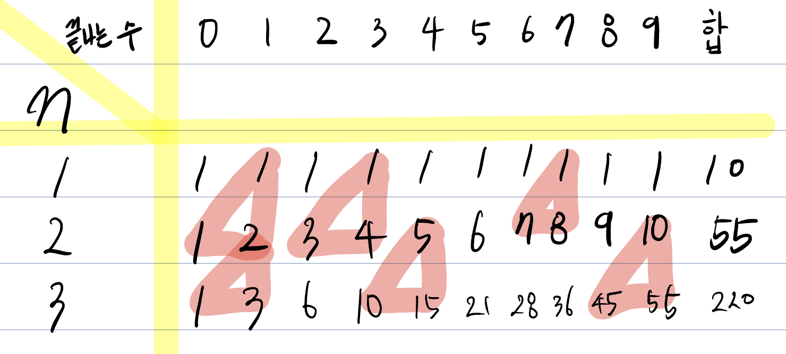

# 다이나믹 프로그래밍

## 중복되는 연산을 줄이자

> 다이나믹 프로그래밍 기법 : 메모리 공간을 약간 더 사용하면 연산 속도를 비약적으로 증가시킬 수 있는 방법 (동적 계획법)  
> 수학적 점화식을 프로그래밍으로 표현하면 편함

```python
# 피보나치 함수를 재귀 함수로 구현
def fibo(x):
    if x == 1 or x == 2:
        return 1
    return fibo(x - 1) + fibo(x - 2)
print(fibo(4))
```

**다이나믹 프로그래밍을 사용할 수 있는 조건**
1. 큰 문제를 작은 문제로 나눌 수 있다.
2. 작은 문제에서 구한 정답은 그것을 포함하는 큰 문제에서도 동일하다.

> 메모이제이션 기법을 통한 문제 해결
> - 다이나믹 프로그래밍을 구현하는 방법 중 한 종류
> - 한 번 구한 결과를 메모리 공간에 메모해두고 같은 식을 다시 호출하면 메모한 결과를 그대로 가져오는 기법
> - 메모이제이션은 값을 저장하는 방법이므로 캐싱이라고도 함
> - 메모이제이션 구현 : 한 번 구한 정보를 리스트에 저장하는 것
> - 다이나믹 프로그래밍을 재귀적으로 수행하다가 같은 정보가 필요할 때는 이미 구한 정답을 그대로 리스트에서 가져오면 된다.

```python
# 8-2.py 피보나치 수열 소스코드 (재귀적)
# 한 번 계산된 결과를 메모이제이션 하기 위한 리스트 초기화
d = [0] * 100

# 피보나치 함수를 재귀함수로 구현 (탑다운 다이나믹 프로그래밍)
def fibo(x):
    if x == 1 or x == 2:
        return 1
    if d[x] != 0:
        return d[x]
    d[x] = fibo(x - 1) + fibo(x - 2)
    return d[x]

print(fibo(99))
```

```python
# 8-3.py 호출되는 함수 확인
d = [0] * 100

def pibo(x):
    print('f(' + str(x) + ')', end='')
    if x == 1 or x == 2:
        return 1
    if d[x] != 0:
        return d[x]
    d[x] = pibo(x-1) + pibo(x-2)
    return d[x]
pibo(6)
```

> 이처럼 재귀 함수를 이용하여 다이나믹 프로그래밍 소스코드를 작성하는 방법을,  
> 큰 문제를 해결하기 위해 작은 문제를 호출한다고 하여 **탑다운 방식**이라고 한다.  
> 반면에 단순히 반복문을 이용하여 소스코드를 작성하는 경우 작은 문제부터 차근차근 답을 도출한다고 하여 **바텀업 방식**이라고 한다

```python
# 앞서 계산된 결과를 저장하기 위한 DP 테이블 초기화
d = [0] * 100

# 첫 번째 피보나치 수와 두 번째 피보나치 수는 1
d[1] = 1
d[2] = 2
n = 99

# 피보나치 함수 반복문으로 구현 (바텀 업 다이나믹 프로그래밍)
for i in range(3, n+1):
    d[i] = d[i-1] + d[i-2]
print(d[n])
```

## 연습문제 풀이

### [백준 11057](https://www.acmicpc.net/problem/11057)

**문제**

> 오르막 수는 수의 자리가 오름차순을 이루는 수를 말한다. 이때, 인접한 수가 같아도 오름차순으로 친다.  
> 예를 들어, 2234와 3678, 11119는 오르막 수이지만, 2232, 3676, 91111은 오르막 수가 아니다.  
> 수의 길이 N이 주어졌을 때, 오르막 수의 개수를 구하는 프로그램을 작성하시오. 수는 0으로 시작할 수 있다.

**입력**

> 첫째 줄에 N (1 ≤ N ≤ 1,000)이 주어진다.

**출력**

> 첫째 줄에 길이가 N인 오르막 수의 개수를 10,007로 나눈 나머지를 출력한다.

**아이디어**
- 글만 읽어서는 규칙 혹은 점화식이 잘 떠오르지 않아서 표로 그려 확인했다.

- 삼각형을 확인하면 대상의 전, 윗 부분을 더해서 구하고자 하는 부분을 구할 수 있다.
- d[i] = d[i-1][j] + d[i][j-1] 이라는 점화식을 구할 수 있다.
- d[i]를 구해 미리 저장하고 이를 다시 활용하는 방식으로 바텀 업 다이나믹 프로그래밍 하는 방식으로 문제를 해결하였다.
- 시간복잡도는 O(N^2)

**예시코드**
```python
# 백준 11057 오르막 수
import sys

input = sys.stdin.readline

n = int(input())

d = [[0] * 10 for _ in range(1001)]
for i in range(10):
    d[0][i] = 1

for i in range(1, n+1):
    d[i][0] = 1
    for j in range(1, 10):
        d[i][j] = d[i - 1][j] + d[i][j - 1]

print((sum(d[n-1])) % 10007)
```